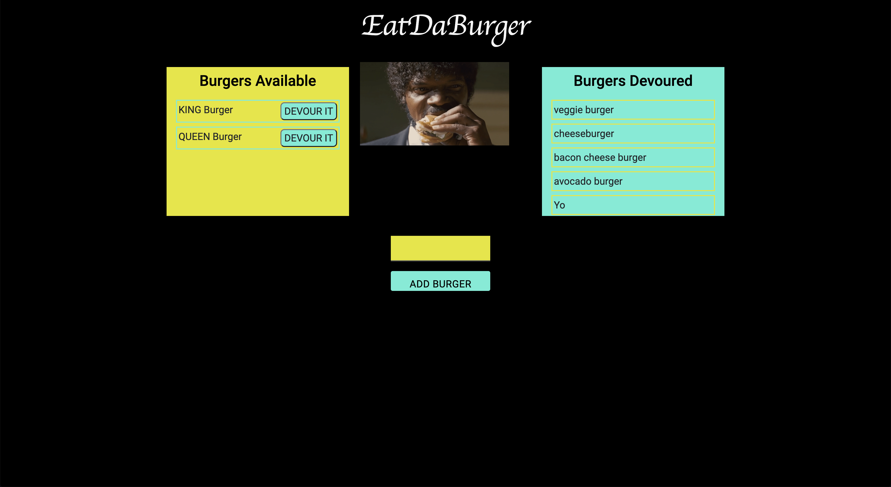

# EatDaBurger 

## Summary
EatDaBurger is a restaurant app that lets users input the names of burgers they'd like to eat. When the user submits a burger's name, the app displays the burger on the left side of the page -- waiting to be devoured. Each burger in the **Available Burgers** waiting area has a `DEVOUR IT` button. When the user clicks it, the burger moves to the right side of the page, under **Burgers Devoured**.

## Prerequisites
* [NodeJS](https://nodejs.org/)



## Demo

EatDaBurger is hosted on Heroku. Check it out by [clicking here]
().

## Getting Started

To use Eat-Da-Burger locally, use http://localhost:8080 after completing the following steps:

```js
git clone https://github.com/Dibello80/EatDaBurger.git
cd EatDaBurger
npm install
node server.js
```

## Technologies Used

* MySQL
* Node.js
* Express
* Handlebars
